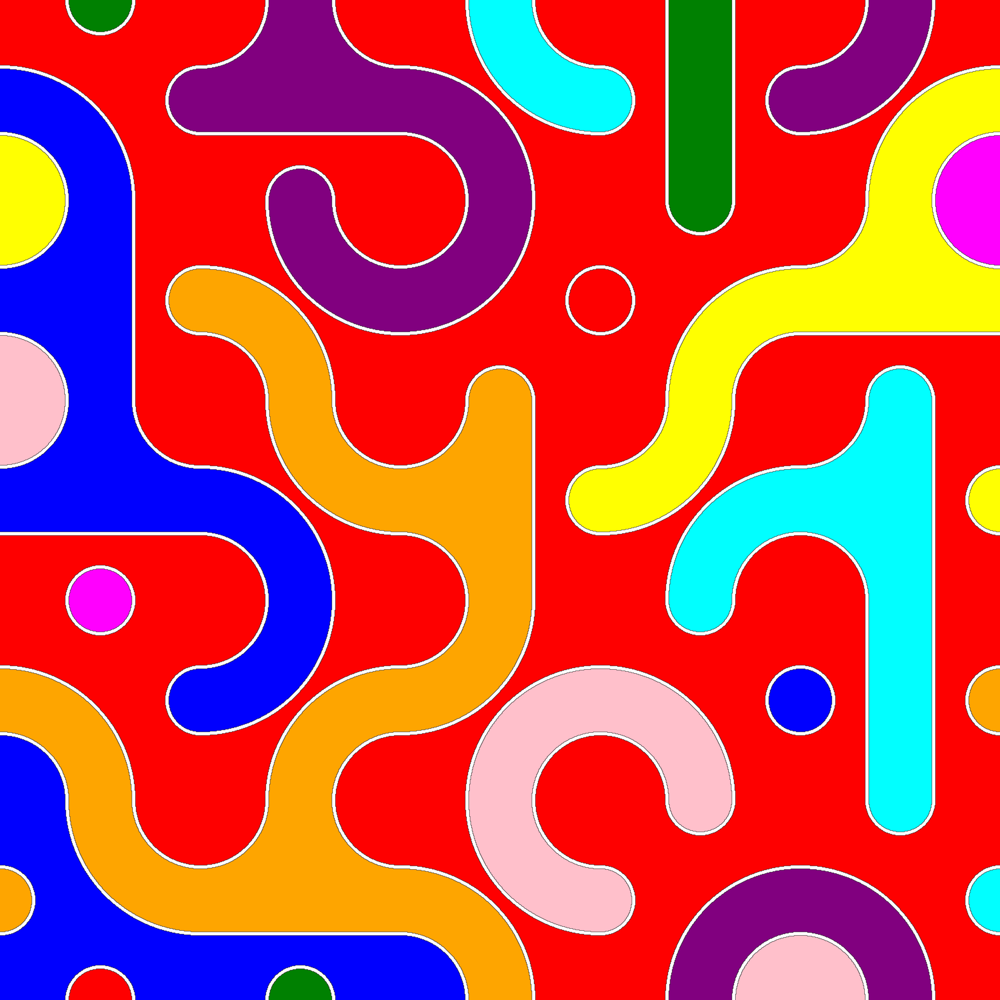

# ncpm
non crossing perfect matching utilized for randomly-generated tesselations

https://en.wikipedia.org/wiki/Catalan_number

## installation

I like using a venv named `env`, but use whatever you want!

```bash
python3 -m venv env
source env/bin/activate
python3 -m pip install -e .
```

## usage

```bash
$ python3 -m ncpm.draw --help
# start here
```

```bash
$ python3 -m ncpm.draw 2 3 --grid --curve formulaic --grid-size 12 --saturation 60
# your generated image will open after processing
```

## gallery



